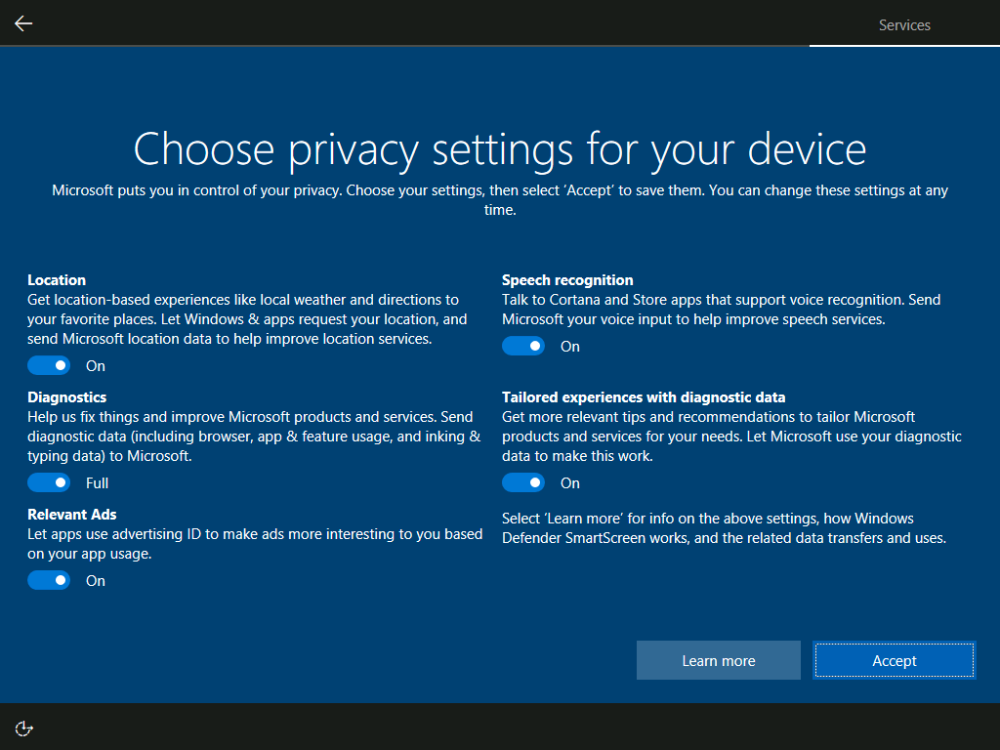

# How to (technologically) protect yourself from the government
You don't. In this political climate, the US government is behaving like a dictatorship - assume you have no rights and plan accordingly. Assume all online activity you do is being tracked. Once the government gets physical possession of your electronics, assume they have access to everything on it regardless of the security measures you put in place.

That sounds incredibly grim, doesn't it? So instead of giving in and behaving like a good citizen, let's be little shits about it. This guide will also protect you from hackers from the internet, assuming the hacker is a random bot, script kid, or a not-targeted-to-you-specifically kind of attack. A lot of practices on this guide can be applied everywhere, however this guide is mostly towards setting up a new computer.

You do not need to follow every single step in this guide. This is your computer, so you know what you do and don't need. Even if I tell you to install or disable something, it's ultimately your choice to decide if that's a feature you do or don't want. Just remember that the more you disable, the less information is being sent to Microsoft, and the less information they have about you.

# Step 1 - Choosing a Secure Password

You can use https://zxcvbn-ts.github.io/zxcvbn/demo/ to check to see if your password is secure or not. Generally try to stick with passphrases instead of passwords (AReallyLongSentenceWithDigits1234 vs MyP@ssw0rd). Remember to save it somewhere later as you probably won't memorize it right away.

## Have I been Pwned?

https://haveibeenpwned.com/ is an incredible service which securely collects and notifies you if your information has been leaked in a data breach. This is a great way to see if your email has been compromised, and if you need to change your password. You can also use this service to check if your password has been leaked in a data breach. If it has, you should change your password immediately. Firefox integrates with this service, and will notify you if your password has been leaked in a data breach. You can read more about this feature here: https://support.mozilla.org/en-US/kb/firefox-password-manager-alerts-breached-websites.

# Step 2 - Windows Installer

After you setup your account, try to disable all of the telemetry toggles. Later on, this will be done automatically by a script, but the sooner the better.

# Step 3 - Windows Updates

After your computer is finished being setup, login to your laptop and go to the settings. The first thing you want to do is update it. Ensure you have downloaded the optional updates too. *Most*  of the time, this will install all the proper drivers and security updates. However, if you have a laptop, you may want to check the manufacturer's website for any drivers that may not be included in the Windows update. This is especially true for laptops that have a lot of custom hardware, such as gaming laptops. Below is a table for some of the most popular hardware manufacturers and their support guides. Generally after installing all of these drivers, your system will perform better and be more stable.

| Manufacturer | Support Guide                                                                                                 |
| :----------: | :------------------------------------------------------------------------------------------------------------ |
|     AMD      | https://www.amd.com/en/support                                                                                |
|     ASUS     | https://www.asus.com/support/Download-Center/                                                                 |
|     Dell     | https://www.dell.com/support/home/en-us?app=drivers                                                           |
|      HP      | https://support.hp.com/us-en/drivers                                                                          |
|    Intel     | https://www.intel.com/content/www/us/en/support/detect.html                                                   |
|    Lenovo    | https://support.lenovo.com/us/en/solutions/ht003029-lenovo-system-update-update-drivers-bios-and-applications |
|    NVIDIA    | https://www.nvidia.com/en-us/software/nvidia-app/                                                             |

If you don't know which one to download, you can reach out to me and I'll walk you through it. After downloading and completely updating Windows, ensure you restart your system.

# Step 4 - Debloating Windows

Windows 10 and 11 come with a lot of bloatware. Bloatware is software that is pre-installed on your computer that you may not need or want. Some of this software can be removed and some of it cannot. The best way to remove this software is to use a debloating script. There are many different debloating scripts available online, but I recommend using the one from the following GitHub repository: https://github.com/Raphire/Win11Debloat. This script can be trusted because the code is open source, and you can see exactly what it does. Also, it has over 18,600 stars. A GitHub star is like a TikTok bookmark, except for developers.

1. First, open up `Powershell`. You can do this by using the start menu in the lower left corner (the Windows icon), searching for `Powershell` and opening it.
2. Copy and paste the following command: `& ([scriptblock]::Create((irm "https://debloat.raphi.re/")))`. This will download the script from the GitHub repository and run it. You may be prompted to allow the script to run, so just click `Yes` or `Allow` when prompted.
3. The script is an interactive program which allows for you to customize what you want to debloat. You can select the options you want by typing in the option number and pressing `Enter`. Any bloatware app that is removed can always be reinstalled through either the Microsoft Store or from an internet search. I imagine the two apps you'll want the most is either [Outlook](https://apps.microsoft.com/detail/9nrx63209r7b) or [OneDrive](https://www.microsoft.com/en-us/microsoft-365/onedrive/download).
4. After the script is finished running, restart your computer. This will ensure that all of the changes made by the script take effect.
5. Lastly, open up your settings, go to Apps, and then uninstall any application you don't want. **Take extra care** to avoid uninstalling any hardware drivers that you installed earlier. If you do, just revisit Step 3. Nothing is permanently broken, you can always try again.

# Step 5 - Encrypting your drive

If the government takes your computer, this will be the *biggest*  thing that stops them from going through your stuff. This Windows Security feature will generate a random 48 digit long password that you will use when a suspected firmware attack happens. If you're wondering how secure that password is, take a look at these StackExchange/SuperUser posts (they're sister websites), which is where a lot of security experts hangout. Don't forget to scroll to view the question asked and the other answers available:

- https://security.stackexchange.com/a/254721/258249

<blockquote>
Fundamentally, you need to think about who your enemies are. Even if some problem with the entropy gathering limited a recovery key or password to 264 possibilities, and even if the attacker could figure out which possibilities those are (which would seem to require a level of knowledge of your system that would render a lot of these other safeguards pointless), it's still very expensive and time consuming to try them all. If somebody is that motivated to crack your encryption then you have a lot of other things to worry about. They may break into your house (undetectably) and install a hardware keylogger, or find the piece of paper you wrote the 128-character password on since it's too long to memorize, etc.
</blockquote>

- https://superuser.com/a/239984

<blockquote>
I've done some further analysis, and I believe I have determined that brute force attacking the recovery password would not be a good use of anyone's time....that is assuming my math is correct.
The recovery password is created starting with a 128-bit key, split into 8 groups of 16 bits of entropy, written as a value between 0 and 65,535 (2^16 - 1). Each group of six digits must be divisible by 11, which is used as a check against keys mistyped by the user when entering the groups.
Each of the 8 groups of 6 digits must be less than 720,896 (which is 2^16 *11); indicating that each of the eight groups has 2^16 possible values, and altogether this means that there are (2^16)^8 possible combinations; which is ~3.4028 x 10^38 combinations.
Assuming we could somehow process 500 trillion passwords an hour (which would be 3,623 times more than the <a href="http://www.online-tech-tips.com/computer-tips/how-to-check-and-test-the-strength-of-your-passwords/" rel="noreferrer">~138 billion passwords per hour capability of a desktop computer in 2008 under 10% load</a>), it would still take us ~7.7 x 10^19 years to brute force crack this 48 character numerical recovery password.
Obviously, attackers would likely not consider brute force attacks against the BitLocker recovery password and would resort to attacking weaker links in the chain.
</blockquote>

Just to be extra clear, this 48 number long password will only be needed when Windows detects an unauthorized change in hardware or firmware. This means you will not need this long password when you boot your computer, and you will not need this long password when you login to your computer.

Step 1. Open up `Settings`
Step 2. Select `Privacy & Security`
Step 3. Choose `Device Encryption`
Step 4. Make sure `Device encryption` is set to `On`
Step 5. Go to https://account.microsoft.com/devices/recoverykey
Step 6. Login to the account you used with your laptop
Step 7. Reading the `BitLocker recovery keys` table, find the key with the most recent `Key upload date` and save it somewhere NOT on your laptop. It can be a picture, it can be on a piece of paper, it can be saved wherever only *you*  can access. Optionally delete it (AFTER SAVING IT) if you don't want Microsoft to try to comply with the government.

Without your BitLocker Recovery Key, you *will*  lose access to your drive if Windows ever detects an unauthorized change to your drive. This is mostly just when you change your hardware (RAM or CPU upgrade) or how you boot your computer (BIOS/UEFI settings). As long as you have your recovery key (or know where to get your recovery key), everything will be okay.

# Step 6 - Installing Firefox

The next step is to install a web browser. I recommend using Firefox because it is open source and has a lot of privacy features built in. It also has a lot of addons that can help to protect your privacy. You can download Firefox from the following link: https://firefox.com/. I highly recommend Firefox over Chrome because Chrome is owned by Google, which is a company that makes money by selling your data. Checkout https://nordvpn.com/blog/firefox-vs-chrome/ for a more in-depth comparison of the two browsers.

## Install an Adblocker.

Install it. Make your internet experience a safer place. Go install https://ublockorigin.com/ if you can. Otherwise https://adblockultimate.net/ is good too. I don't recommend having both installed, but that's your call. Having both enabled at the same time can cause issues with some websites, so it's best to just pick one and stick with it.

## Go through Firefox Settings.

Firefox's settings generally have good defaults, however you may want to go through them and make sure that everything is set up the way you want it. This is one of the "little things" that really makes-or-breaks the user experience.

### Home Page Settings

Step 1. On the home page of Firefox (open up a new tab if you can't find it), click on the settings icon in the bottom right corner.
Step 2. Disable the things you don't want. I recommend disabling shortcuts and recommended stories, maybe change the background too if you'd like.

### Customize the Search Bar

Step 1. Go to the blank space on the search bar and right click on it. Click `Customize Toolbar...`
Step 2. Drag and drop the extra spaces off from the bar (personal preference)
Step 3. Drag and drop the shielded down arrow icon (Pocket) off from the bar (personal preference)
Step 4. Close the tab, it'll save automatically.
Step 5. Press Ctrl+Shift+B at the same time to open/close the bookmarks bar (personal preference)

### Firefox Settings

Step 1. Press the three lines in the top right corner of Firefox, and select `Settings`.
Step 2. Make Firefox your default browser. Windows will still use Edge sometimes, but this will help to make sure that Firefox is used as much as possible.
Step 3. Import your bookmarks from Chrome. If you don't have any bookmarks, or if you don't have Chrome installed, you can skip this step.
Step 4. Scroll down to `Files and Applications` and check `Always ask where to save files.` This will help make sure you don't accidentally download files/viruses without knowing it.
Step 5. Scroll down to `Digital Rights Management (DRM) Content` and make sure `Play DRM-controlled content` is enabled. While DRM is generally frowned upon in an open source context, websites like Spotify or Disney+ require DRM to work. If you don't have this enabled, you won't be able to use these services. In this case, we're choosing usability over privacy.
Step 6. Go to `Search` on the left menu.
Step 7. Change your default search engine to DuckDuckGo.

<blockquote>
10-20 years ago, Google was a really good search engine. However, around 2015 after they removed their "Don't be evil" clause in their code of conduct... and they became a lot more evil. Jokes aside, Google is a data mining company that makes money by selling your data, which is why you see an extreme amount of ads within a normal Google search. DuckDuckGo is an open source search engine, which means that anyone can see the code and verify that it is safe. It also has a lot of privacy features built in, such as not tracking your searches or selling your data. You can read more about DuckDuckGo here: <a href="https://duckduckgo.com/about" rel="noreferrer">https://duckduckgo.com/about</a>.
</blockquote>

Step 8. Scroll down and disable suggestions from sponsors.
Step 9. Go to `Privacy & Security` on the left menu.
Step 10. Choose `Strict` under `Enhanced Tracking Protection`. This will help to block trackers and ads that are trying to follow you around the internet. You can read more about Enhanced Tracking Protection here: https://support.mozilla.org/en-US/kb/enhanced-tracking-protection-firefox-desktop. I have used the `Strict` setting for years now, and haven't had many issues with it. Worst comes to worst, open up the website in Microsoft Edge.
Step 11. Scroll down to `Passwords`.

<blockquote>
If you want to use Firefox as a password manager, you can enable <code>Ask to save logins and passwords for websites</code>. I recommend this feature for convenience, especially if you're using Firefox on your phone and have synced your accounts, however it is not necessary. If you don't want to use Firefox as a password manager, you can disable this feature. Alternatively, if you want to use a different password manager that's more capable, you can use a service like Bitwarden or 1Password. My personal preference is Microsoft Authenticator as it manages your 2FA codes, passwords, addresses, and credit cards all in one place. However having all that information in one place is trading security for convenience, so it's up to you to decide what you want to do.
If you do decide to use Firefox as your password manager, make sure you set a <code>Primary Password</code> to protect your saved passwords. If you ever leave your laptop unattended, anyone can open up Firefox and see all of your saved passwords when a primary password is not set. This is a huge security risk, and I highly recommend that you set a primary password. You can read more about the primary password feature here: <a href="https://support.mozilla.org/en-US/kb/using-primary-password-sync" ref="noreferrer">https://support.mozilla.org/en-US/kb/using-primary-password-sync</a>.
</blockquote>

Step 12. Scroll down to `Forms & Autofill` and disable `Save and fill payment methods`.

<blockquote>
If in the extremely unlikely event that Firefox gets hacked, you don't want your credit card information to be stolen. Generally your credit cards is something you keep on you at all times anyways, so it's not a huge deal to have to type it in every time you want to buy something. If you do want to use this feature, consider using a password manager that stores everything locally and securely.
</blockquote>

Step 13. Scroll down to `Permissions` and disable `Block pop-up windows`. I've found that this setting is a little too aggressive, and it blocks pop-ups that I actually want to see. You can always enable it again later.
Step 14. Scroll down to `Firefox Data Collection` and uncheck each setting. Mozilla is generally a trusted company, however we're going for security, not kindness here.
Step 15. Scroll down to `HTTPS-Only Mode` and select `Enable HTTPS-Only Mode in all windows`.

<blockquote>
This will help to ensure that you're always using a secure connection when browsing the web. You can read more about HTTPS-Only Mode here: <a href="https://support.mozilla.org/en-US/kb/https-only-prefs" rel="noreferrer">https://support.mozilla.org/en-US/kb/https-only-prefs</a>. TL;DR, this makes sure your connection is always encrypted and secure.
</blockquote>

Step 16. Scroll down to `Enable DNS over HTTPS`. If you're going to follow Step 7 below, set the setting to `Off`. If you're not going to follow Step 7, set the setting to `Max Protection`.

# Step 7 - Installing a secure DNS Resolver

DNS (Domain Name System) is a system that translates domain names into IP addresses. This is how your computer knows where to go when you type in a website address. By default, Windows uses the DNS servers provided by your internet service provider (ISP). However, these DNS servers can be slow and unreliable. Additionally, they can also be used to track your online activity. To prevent this, we can use a secure DNS resolver and encrypt our DNS queries. This will help to protect your privacy and ensure a fake DNS server doesn't return a fake website (DNS hijacking).

## Installing Technitium DNS Server

We're going to use Technitium's DNS Server because it's free, open source, and easy to use. As far as I'm aware, it supports every feature/standard that DNS offers, including DNSSEC, DoH, DoT, and DoQ (all security techniques). It also has a built-in DNS cache, which can help to speed up your internet in very high latency situations (such as when you're in the country-side with unstable internet). We're going to be using DoH to encrypt your traffic, which cannot be easily tracked and looks like normal internet usage. Checkout Cloudflare's guide on this: https://www.cloudflare.com/learning/dns/dns-over-tls/. Cloudflare is the current backbone of the internet, with over 50% of the *collective*  internet traffic, both legal and illegal, going through it. They're an internationally based privacy focused company who continuously pledges and meets their pro-privacy and pro-environment practices.

Step 1. Download https://download.technitium.com/dns/DnsServerSetup.zip
Step 2. Unzip the file and run the installer. Windows might say `Windows protected your PC`. It did not. Technitium didn't want to pay a $600 yearly fee to remove that window. The code is open source, meaning you can read the code yourself and see that it is safe. In the bottom right of the alert window, click `More info` and then `Run anyway`.
Step 3. After the DNS server is installed, go to the system tray in the bottom right corner of your screen. It looks like a little up arrow. Click on it and find the Technitium DNS Server icon, which should be a [blue and white square](https://raw.githubusercontent.com/TechnitiumSoftware/DnsServer/refs/heads/master/DnsServerSystemTrayApp/logo2.ico) . Right click on it, and select "Dashboard."
Step 4. Setup your password. This is the password that will be used to access the DNS server settings. Realistically, everything will be okay if you forget this password and you never access the dashboard again. However the password should still be saved somewhere in case if something breaks.
Step 5. Download the [pre-configured settings](dns-server_2025-04-09_23-15-41_backup.zip).
Step 6. Next go to settings and scroll down to `Restore Settings`. Select the file you just downloaded and then press `Restore`.

# Step 8 - Using a VPN

VPN's are... a tricky thing. On one hand, connecting to a VPN will keep you secure from most immediate threats. VPN's are also really good for bypassing geo-restrictions when using websites like Netflix or DisneyPlus. On the other hand, you're just passing all your data to someone else. The point of cybersecurity is to have a single point of trust and then trust nothing else. If that single point of trust (the VPN in our case) is compromised, then it's pointless.

The VPN's I recommend are either ProtonVPN or MullvadVPN. I recommend ProtonVPN because the company is based on Switzerland, which has some of the best privacy laws in the world. They also have a free plan that is actually usable, and they don't log your data. MullvadVPN is also a great option because they don't require an email address or any personal information to sign up.

# Step 9 - Installing Anti-virus Software

It's already installed. The best anti-virus is Windows Defender, which is enabled by default. The other anti-virus software are mostly scams, beyond scanning for some ancient virus patterns from 2007.

The second best anti-virus is *you*. Stay educated, be suspicious of everything new. ***Always ask "why?"*** The software you installed has been configured to let you know the moment anything suspicious happens. Nothing will be installed without your permission and only you are in control of your data.
